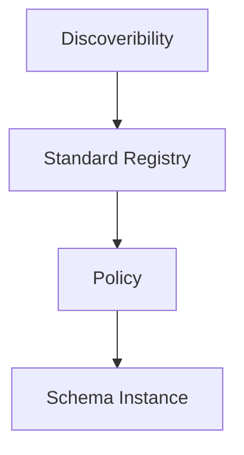

# Guardian Compliance Specification

_Grammers/Spelling to be fixed later_

Documentation for how the Guardian produces assets, breaking down all the HCS and IPFS messages, as well as highlighting identity points.

## Overview

This document is to outline the entire flow (tree structure) of how Guardian assets are created on Hedera, the aim will be to inform growth into formal specification based on the current work and documentation from the community. In turn, this specification will empower other stakeholders to build their own Guardian-lite systems that generate compliant credits or to fork other open source platforms.

The outline mapping initially comprises elements from two parties, Guardian V2 Provenance PDF document created from Meeco/Ledger works and the tracking of the ELV (end-of-life vehicle) credit from DOVU in partnership with MMCM.

## Basic diagram of Topics

Below is a diagram of the overarching topic structure for the standard registry, the standard actor within the Guardian instance to follow this path.

It all starts with a discoverability topic, this allows Downstream consumers to understand the tree structure of everything to do with the particular Guardian Derived asset.

Next, the standard registry topic describes all of the policies that they've given registry may publish onchain.

Define a few topics are to do with the policy itself that has been published, with all of its schemas and additional data. And then, finally schema instances where all data streams for a policy stems to.



## The Discoverability Topic

A topic that acts as a repository for the registration for all Standard Registry entities.

The topic id that is responsible for this is: https://hashscan.io/mainnet/topic/0.0.1368856

A message from DOVU is: https://hashscan.io/mainnet/transaction/1702315239.528390003

It differs from the V2 spec as the signature hasn’t been included in the payload.

## Standard Registry Base Topic

The topic id: [0.0.4247468](https://hashscan.io/mainnet/topic/0.0.4247468) refers to the child topic of the standard registry.

This topic lists all the non-policy specific actions (types) linked to IPFS storage, all of these will be further documented in the future but briefly:

- Topic: points to child topic or in the case of a root message, just the parent topic
- DID-document: Creation of a DID entity that provides the public keys with specific verification methods listed (BBS in this context provides an auditor ability)
- Policy: A definition of a new policy with some details, and pointing to a child topic.
- Schema: This links to two IPFS documents, where you have data and a reference to the context of the definition of a schema.

## Policy context and Schema Registration Topic

This topic 0.0.4314630: https://hashscan.io/mainnet/topic/0.0.4314630

## Schema Instance Topic

This topic: https://hashscan.io/mainnet/topic/0.0.4314639?p=39&k=1702645124.926160507

```json
{
  "id": "b5bc9ca4-8306-42b4-ad92-7292e3f2a7dd",
  "status": "ISSUE",
  "type": "Topic",
  "action": "create-topic",
  "lang": "en-US",
  "name": "mmcm_elv_production",
  "description": "INSTANCE_POLICY_TOPIC",
  "owner": "did:hedera:mainnet:5p2accSH5fLpEQfKZx5aH5uJjVypFD9pGW3wXfuinhdD_0.0.4247468",
  "messageType": "INSTANCE_POLICY_TOPIC",
  "childId": null,
  "parentId": "0.0.4314630",
  "rationale": "1702644448.523506003"
}
```
